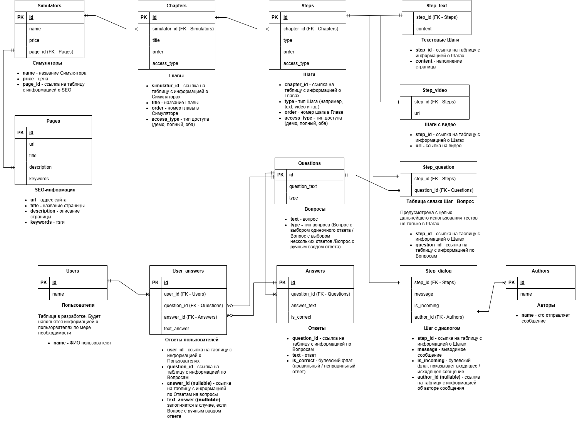

# lms-database
Проектирование базы данных для LMS-платформы с курсами, уроками и тестами

# 📚 LMS Database Design

## 📌 Описание проекта

Проект базы данных для LMS (Learning Management System).

Система предназначена для хранения и управления обучающим контентом:
симуляторы (курсы), главы, шаги (текст, видео, вопросы, диалоги), а также тесты и ответы пользователей.

## 🧩 Основные сущности

* **simulators** — обучающие курсы
* **chapters** — главы внутри курса
* **steps** — шаги внутри главы
* **step_text / step_video / step_question / step_dialog** — типы контента шагов
* **questions / answers** — тестовые задания
* **users / user_answers** — ответы пользователей
* **pages** — SEO и URL страниц

## 🔗 Связи

* один симулятор → много глав
* одна глава → много шагов
* один шаг → один тип контента (1:1)
* один вопрос → много ответов
* один пользователь → много ответов

## 🛠 Используемые технологии

* PostgreSQL
* SQL
* DBeaver
* draw.io

## 🗂 Структура проекта

* `sql/create_tables.sql` — создание таблиц
* `sql/insert_sample_data.sql` — тестовые данные
* `sql/queries.sql` — примеры запросов
* `schema/schema.drawio` — схема базы данных

## 📊 Примеры запросов

В проекте реализованы SQL-запросы для:

* получения шагов курса
* вывода вопросов и вариантов ответов
* анализа ответов пользователей
* проверки правильности ответов

## 🚀 Как запустить

1. Создать новую базу данных (например, в DBeaver)
2. Запустить `create_tables.sql`
3. Запустить `insert_sample_data.sql`
4. Выполнить запросы из `queries.sql`

## 📷 Схема базы данных

## 💡 Особенности

* нормализованная структура
* использование внешних ключей
* расширяемая архитектура (легко добавлять новые типы шагов)
